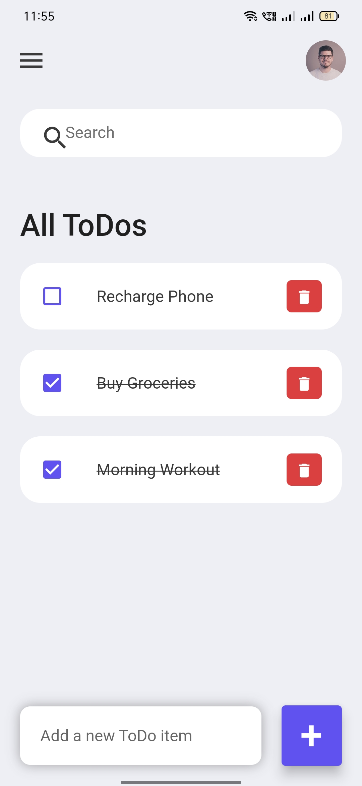

# ToDo Application

A Beginner Flutter project.

A ToDo application using Flutter and Dart, resulting in a 20% increase in task management efficiency. Implemented features to create, manage, and delete tasks, leading to a 30% reduction in missed deadlines. Developed a cross-platform responsive application. 

## Screenshots
ToDo UI

Adding a new task to be managed

Mark as done 

Delete a task

Search for a task

